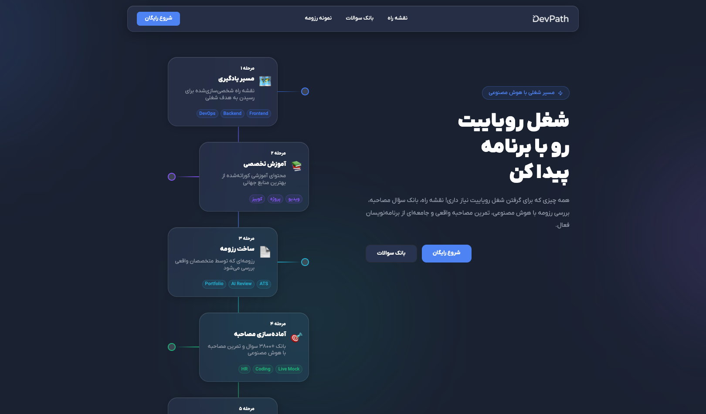

# DevPath

<p align="center">
  
</p>

<p align="center">
  A personalized career roadmap platform for programmers — curated learning paths, an AI-reviewed resume builder, and an interview prep question bank, all in one place.
</p>

<p align="center">
  
  
  
  
  
</p>

---

## About

DevPath helps programmers go from "I don't know where to start" to landing a job, through four connected stages:

1. **Learning Path** — a personalized, self-paced roadmap toward a chosen career goal
2. **Specialized Training** — curated courses, quizzes, and projects from top resources
3. **Resume Building** — build a resume reviewed by real specialists, with a sample resume gallery for inspiration
4. **Interview Prep** — a bank of 3,800+ questions and coding/HR mock interviews, AI-assisted

## Tech Stack

- **Framework:** Next.js (App Router)
- **Language:** TypeScript
- **Database:** PostgreSQL (Supabase)
- **ORM:** Prisma
- **Auth:** NextAuth (GitHub provider)
- **Styling:** Tailwind CSS
- **Icons:** Lucide

## Getting Started

### Prerequisites

- Node.js 18+
- A Supabase project (or any PostgreSQL database)

### Installation

```bash
git clone https://github.com/your-username/devpath.git
cd devpath
npm install
```

### Environment Variables

Create a `.env` file in the root:

```env
DATABASE_URL="postgresql://postgres:[PASSWORD]@[HOST]:5432/postgres"
GITHUB_ID="your-github-oauth-id"
GITHUB_SECRET="your-github-oauth-secret"
NEXTAUTH_SECRET="your-nextauth-secret"
NEXT_PUBLIC_SUPABASE_URL="https://your-project.supabase.co"
NEXT_PUBLIC_SUPABASE_ANON_KEY="your-anon-key"
```

### Database Setup

```bash
npx prisma generate
npx prisma migrate dev
```

### Run Locally

```bash
npm run dev
```

The app will be running at `http://localhost:3000`.

## Project Structure

```
devpath/
├── app/
│   ├── roadmap/        # learning path pages
│   ├── questions/       # interview question bank
│   ├── resumes/          # sample resume gallery
│   └── layout.tsx
├── components/
│   ├── backButton/
│   ├── layout/
│   └── resumes/
├── content/
│   ├── questions/
│   └── roadmaps/
├── hooks/
├── lib/
│   └── prisma.ts
├── prisma/
│   └── schema.prisma
└── types/
```

## Roadmap

- [ ] AI-powered resume review
- [ ] Live mock interview scheduling
- [ ] Progress tracking dashboard
- [ ] More curated learning tracks

## License

MIT
